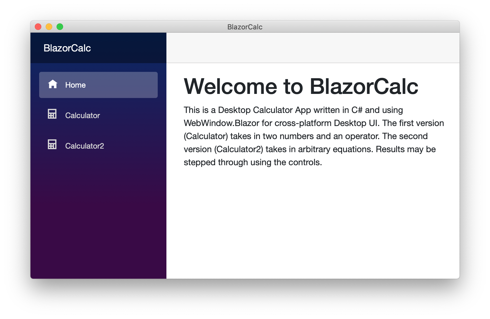
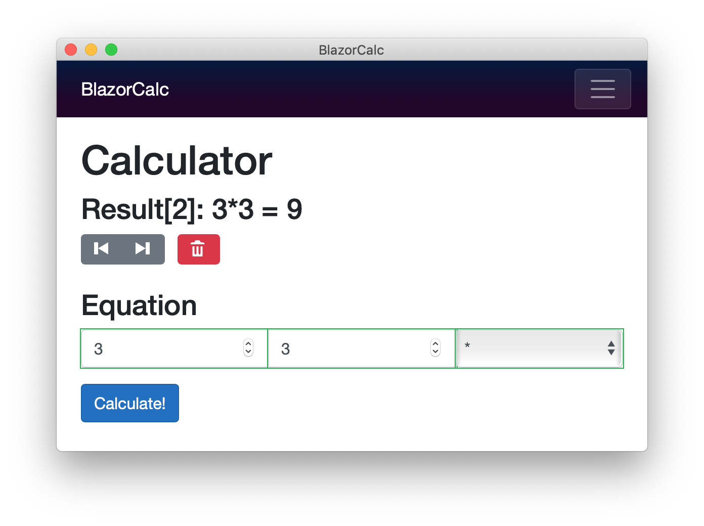
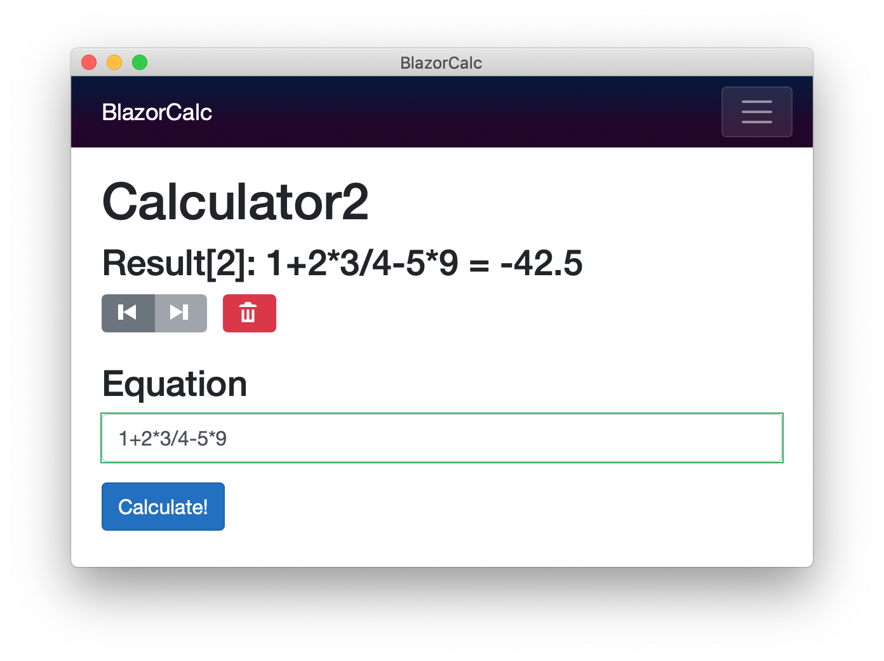

# Blazor Calculator Project

# Resources

* https://stackoverflow.com/questions/333737/evaluating-string-342-yield-int-18
* https://blog.stevensanderson.com/2019/11/18/2019-11-18-webwindow-a-cross-platform-webview-for-dotnet-core/
* https://blazor-university.com/forms/editing-form-data/
* https://docs.microsoft.com/en-us/aspnet/core/blazor/forms-validation?view=aspnetcore-3.1
* https://docs.microsoft.com/en-us/dotnet/architecture/blazor-for-web-forms-developers/components
* https://docs.microsoft.com/en-us/dotnet/api/system.collections.generic.list-1?view=netcore-3.1
* https://stackoverflow.com/questions/23092081/antlr4-visitor-pattern-on-simple-arithmetic-example
* https://stackoverflow.com/questions/8590402/antlr-for-c-sharp-and-clscompliant-attribute
* https://github.com/mlindegarde/blog--antlr4-dotnet-core/blob/master/visitor/src/Calculator/Parsing/CalculatorVisitor.cs
